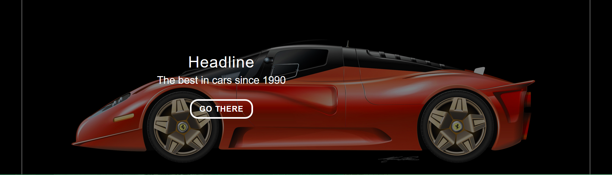
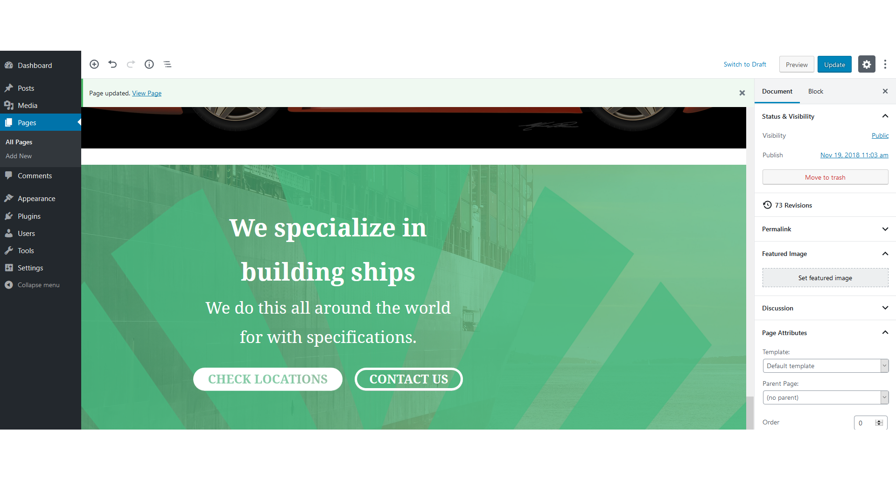
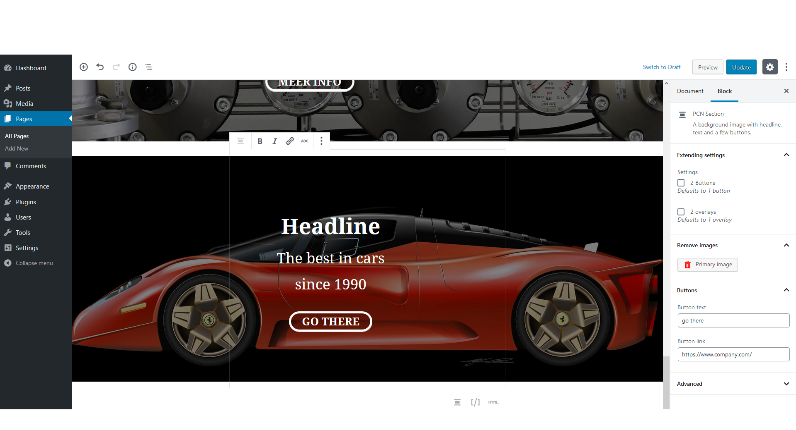

# Full width text and button overlay cards

A plugin created for the specific needs of a client.

This plugin adds a block which can be put anywhere.
It is a **full width** block has a **background image** which automatically gets **overlayed** by a **semi-transparant black background** or another **specified image.**
The block contains a **header, paragraph** and a **button**. (Can also be set to **2** buttons).

## Author

Laytan Laats

[Github](https://www.github.com/laytan)

[Laytanlaats@hotmail.com](mailto:laytanlaats@hotmail.com)

## Extend on this

You are free to extend on this plugin as needed.

### How to

1. git clone / download zip
2. run `npm install`
3. run `npm run dev` for development and `npm run build` when you're done (minifies the code etc. )

## Screenshots / output

### All options, front-end

### Basic, front-end

### All options, editor

### Basic, editor

